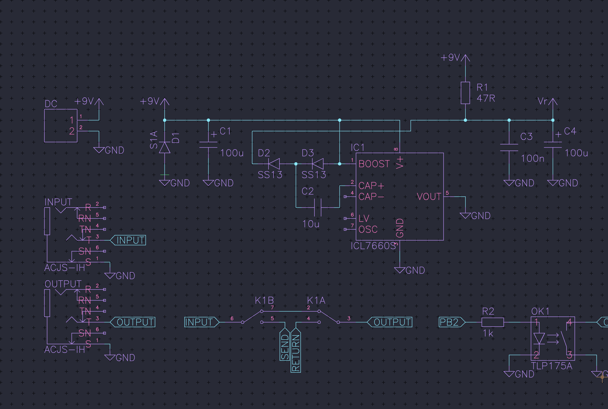
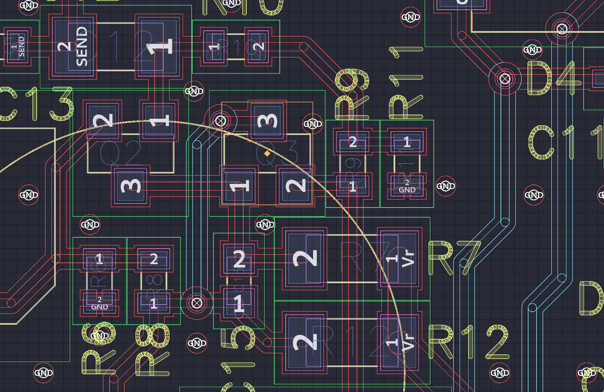
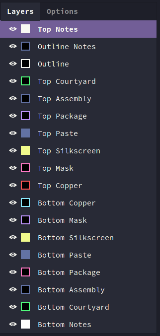

# horizon-theme-dracula

Dracula colors for Horizon! Because, why not.

Schematic view :

  

Board view :

  

I think it's easier on the eyes when you only display the outlines of most layers like illustrated below, so that the dominant color is the background. Pretty much like it would be in an IDE :

  

